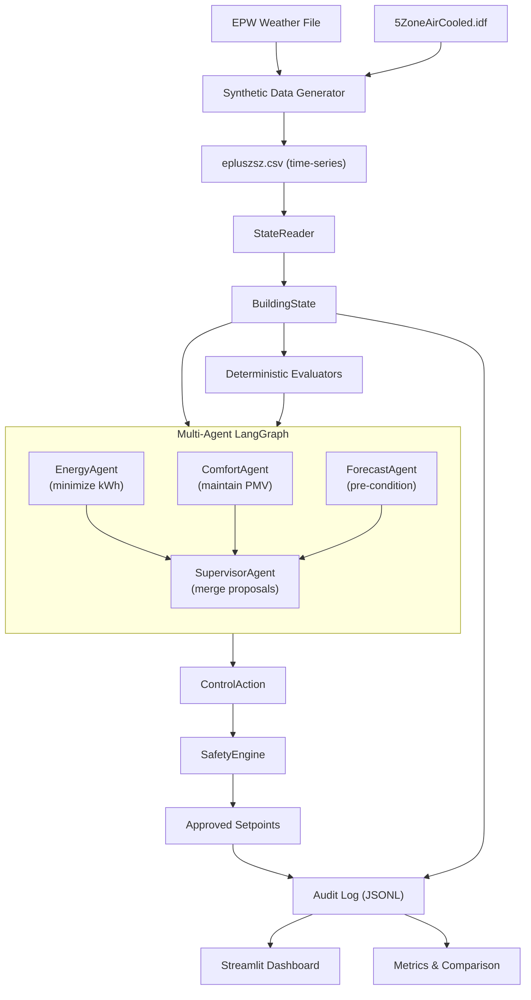

# Eco-Loop: System Architecture Report

## 1. System Overview

Eco-Loop is a safety-governed autonomous building operator. A multi-agent LLM system
(via Azure OpenAI / Ollama) reasons over EnergyPlus digital-twin telemetry, proposes
structured HVAC actions, and a deterministic safety layer applies safe commands. The
system proves measurable energy savings while maintaining thermal comfort.

### 1.1 Core Claim

Using one identical building model, weather file, run period, and reporting configuration,
Eco-Loop compares a fixed-schedule baseline controller against an AI-assisted, forecast-aware,
multi-agent closed-loop controller. The AI-driven run reduces energy consumption while
maintaining comfort during occupied periods.

---

## 2. Architecture



### 2.1 Component Responsibilities

| Component | Responsibility | Boundary |
|-----------|---------------|----------|
| **StateReader** | Parse EnergyPlus CSV output, build typed `BuildingState` | Read-only; no side effects |
| **Evaluators** | Compute comfort margin, demand trend, forecast opportunity, MPC recommendation | Deterministic; suggestions only |
| **MPC Optimizer** | Predict zone temps with 3R-2C thermal model, optimize over 4h horizon | Deterministic; feeds evaluator |
| **Multi-Agent System** | EnergyAgent + ComfortAgent + ForecastAgent + SupervisorAgent | LangGraph orchestration |
| **LLM Client** | Request structured `ControlAction` from Azure OpenAI / Ollama | Falls back to deterministic |
| **SafetyEngine** | Validate, clamp, or reject proposals | Non-negotiable; no bypass |
| **BaselineController** | Fixed-schedule reference controller | Deterministic; no LLM |
| **AuditLog** | Append-only event logging | JSONL format |
| **Dashboard** | Streamlit visualization with Plotly charts | Read-only; no control logic |
| **MCP Server** | 8 tools via FastMCP for external LLM clients | stdio/HTTP transport |
| **SyntheticGenerator** | Time-series data from EPW weather | Used when EnergyPlus not available |

### 2.2 Data Flow

1. **Input**: EPW weather file + IDF model -> synthetic time-series data (or real EnergyPlus output)
2. **State**: CSV parsed into `BuildingState` dataclass with zone temps, humidity, occupancy, power
3. **Evaluation**: Deterministic evaluators compute comfort, energy, forecast, oscillation, and MPC signals
4. **Decision**: Multi-agent LLM system (or single-agent fallback) returns structured `ControlAction`
5. **Validation**: SafetyEngine clamps/rejects unsafe proposals
6. **Actuation**: Approved setpoints logged (in live mode, written to EnergyPlus via callback)
7. **Logging**: Every step logged to JSONL with full state, proposal, and outcome
8. **Visualization**: Dashboard renders replay, comparison, comfort, and audit views

---

## 3. Multi-Agent Architecture

### 3.1 Agent Hierarchy

```
SupervisorAgent (merge with priority: Safety > Comfort > Energy)
    |
    +-- EnergyAgent: Minimize HVAC energy consumption
    |   - Widen deadband for unoccupied zones
    |   - Reduce runtime when outdoor temps are mild
    |
    +-- ComfortAgent: Maintain PMV in [-0.5, 0.5]
    |   - Adjust setpoints to maintain comfort
    |   - Prioritize occupied zones
    |
    +-- ForecastAgent: Optimize for predictions
        - Pre-cool before hot weather
        - Pre-heat before cold weather
        - Begin setback near end of occupancy
```

### 3.2 Supervisor Merge Rules

1. **Occupied zones**: Use ComfortAgent's setpoints (comfort priority)
2. **Unoccupied zones**: Use EnergyAgent's setpoints (energy priority)
3. **Pre-conditioning**: Apply ForecastAgent's recommendations for unoccupied zones approaching occupancy
4. **Conflict resolution**: When agents disagree, prefer the tighter comfort band for occupied zones

### 3.3 Fallback Chain

```
Multi-Agent (4 Azure calls) --> Single-Agent LLM --> Ollama --> Deterministic Hold
```

If the multi-agent graph fails (any exception), the system falls back to the single-agent
LLM client. If that also fails, Ollama is tried. Final fallback is always deterministic.

---

## 4. Control Cycle

At each 15-minute simulated control boundary:

```
1. OBSERVE    Read zone temps, humidity, occupancy, power from CSV
              Build typed BuildingState + rolling history

2. EVALUATE   Compute comfort margin, demand trend, forecast opportunity
              Run MPC optimizer for 4h setpoint recommendation
              (deterministic evaluators; suggestions only)

3. DECIDE     Run multi-agent LangGraph (Energy + Comfort + Forecast -> Supervisor)
              Or single-agent LLM (primary -> fallback -> deterministic)
              Hard timeout: 30s CPU / 10s GPU per agent call

4. VALIDATE   SafetyEngine: clamp setpoints, enforce deadband, rate-limit
              If proposal is null: generate conservative hold action

5. ACTUATE    Apply approved setpoints (callback or IDF modification)

6. LOG        Append complete event to audit.jsonl
              Record: LLM source, model, latency, safety outcome, action
```

### 4.1 Failure Modes

| Failure | Response | Audit Record |
|---------|----------|--------------|
| Multi-agent graph fails | Fall back to single-agent LLM | `source: "primary"` or `"fallback"` |
| LLM unavailable | Fallback model -> deterministic | `source: "deterministic"` |
| LLM timeout | Deterministic fallback | `source: "deterministic"`, `latency_ms: 0` |
| LLM returns invalid JSON | Deterministic fallback | `source: "deterministic"` |
| Safety engine clamps | Log clamped values | `safety_status: "clamped"`, reasons listed |
| EnergyPlus error | Continue with synthetic data | Logged in controller output |

---

## 5. MPC Optimizer

### 5.1 Thermal Model

The MPC uses a simplified **3R-2C thermal network model**:

```
                    R_wall
T_outdoor ---/\/\/\/--- T_zone_air --- C_zone
                            |
                        R_window
                            |
                        C_mass (building thermal mass)
```

Parameters are zone-specific:
- **Core zones** (SPACE1-1, SPACE3-1): High thermal mass, small temperature swings
- **Perimeter zones** (SPACE2-1, SPACE4-1): Lower mass, more outdoor influence
- **Top floor** (SPACE5-1): Lightest mass, most temperature swing

### 5.2 Optimization

- **Horizon**: 4 hours (16 steps at 15-min intervals)
- **Resolution**: 0.5 C setpoint candidates
- **Scoring**: Energy cost + comfort penalty (3x weight for occupied zones)
- **Constraints**: All safety limits enforced (ranges, deadband, rate limits)

The MPC recommendation is included as an evaluator signal (`mpc.recommendations`)
in the LLM prompt, providing model-predictive guidance.

---

## 6. Safety Engine

### 6.1 Safety Rules

| Rule | Limit | Enforcement |
|------|-------|-------------|
| Heating setpoint | 18-24 C | Clamp to range |
| Cooling setpoint | 22-28 C | Clamp to range |
| Minimum deadband | 2 C (heating + 2 <= cooling) | Enforce minimum gap |
| Max setpoint change per 15-min step | 0.5 C | Rate-limit delta |
| Max setpoint change per hour | 2.0 C | Cumulative rate-limit |
| PMV comfort band | -0.5 to +0.5 (ASHRAE-55 Cat II) | Monitor and report |
| Unoccupied setback | Heating 18 C / Cooling 28 C | Automatic for unoccupied zones |

### 6.2 Safety Guarantees

- **No bypass**: SafetyEngine is a frozen dataclass; rules cannot be modified at runtime
- **No retry loops**: Failed LLM calls immediately fall back; no blocking retries
- **Immutable config**: Safety limits loaded once at startup from frozen dataclass
- **Audit trail**: Every clamping event is logged with the original proposal and the clamped value

---

## 7. LLM Integration

### 7.1 Provider Configuration

| Role | Provider | Model | Fallback |
|------|----------|-------|----------|
| Primary | Azure OpenAI | gpt-5.4-mini | Ollama |
| Fallback | Ollama | Llama 3.1 8B Instruct | Deterministic |
| Final | Deterministic | Rule-based hold | N/A |

Configuration via environment variables:
```
ECOLOOP_LLM_MODE=azure-first        # azure-first | azure | ollama | deterministic
AZURE_OPENAI_API_KEY=...
AZURE_OPENAI_ENDPOINT=https://...
AZURE_OPENAI_DEPLOYMENT_NAME=gpt-5.4-mini
```

### 7.2 Prompt Contract

Each agent's prompt includes:
1. **Role**: Specialized objective (energy, comfort, or forecast)
2. **Hard constraints**: Setpoint ranges, deadband, rate limits
3. **Current state**: JSON snapshot of BuildingState
4. **Evaluator signals**: Structured comfort, energy, forecast, and MPC metrics
5. **Action schema**: Exact JSON structure required
6. **Output rules**: JSON only, no markdown, no commentary

### 7.3 LLM Latency Policy

| Setting | Value | Notes |
|---------|-------|-------|
| Primary timeout (GPU) | 10s | Per agent call |
| Primary timeout (CPU) | 30s | Includes model loading |
| Multi-agent total | ~40s | 4 sequential calls |
| Fallback timeout | Same as primary | |
| Deterministic fallback | Immediate | Hold current setpoints |

---

## 8. State Schema

```python
@dataclass(frozen=True)
class BuildingState:
    timestamp: datetime
    step_index: int
    zone_temps_c: dict[str, float]
    zone_relative_humidity_pct: dict[str, float]
    occupancy: dict[str, float]
    heating_setpoints_c: dict[str, float]
    cooling_setpoints_c: dict[str, float]
    zone_pmv: dict[str, float]
    zone_ppd_pct: dict[str, float]
    outdoor_temp_c: float
    forecast_outdoor_temp_c: list[float]
    hvac_power_kw: float | None
    facility_power_kw: float | None
    cumulative_facility_energy_kwh: float | None
    recent_history: list[StateSummary]
```

---

## 9. MCP Server (Model Context Protocol)

### 9.1 Tool Inventory

```yaml
# Observation Tools (3)
- read_zone_telemetry: Current zone temps, humidity, occupancy, outdoor conditions
- read_zone_history: Recent control step history from audit log
- read_safety_limits: Active safety engine constraints

# Control Tools (2)
- check_action_safety: Validate proposed action without applying
- propose_setpoints: Propose and validate zone setpoint changes

# Simulation Tools (1)
- run_simulation_comparison: Full baseline vs AI comparison

# Audit Tools (2)
- read_audit_log: Recent audit log entries
- list_output_directories: Available simulation outputs
```

### 9.2 Transport

- **stdio**: For Claude Desktop, local MCP clients
- **streamable-http**: For remote HTTP clients (port 8000)

---

## 10. Baseline Controller

The baseline uses a fixed schedule (intentionally naive for comparison):

| Condition | Heating Setpoint | Cooling Setpoint | Mode |
|-----------|-----------------|------------------|------|
| Occupied (Mon-Fri 8am-6pm) | 20 C | 26 C | normal |
| Unoccupied | 18 C | 30 C | setback |

No pre-conditioning, no forecast awareness, no adaptive adjustments.

---

## 11. Technology Stack

| Concern | Technology | Rationale |
|---------|-----------|-----------|
| Simulation | EnergyPlus 26.1 | Industry-standard building energy simulation |
| Runtime integration | PyEnergyPlus API | Callback-based actuation during simulation |
| LLM primary | Azure OpenAI (gpt-5.4-mini) | Cloud-hosted, fast, structured output |
| LLM fallback | Ollama (Llama 3.1 8B) | Local, open-source, no API keys |
| Multi-agent | LangGraph | Hierarchical agent orchestration |
| LLM framework | LangChain OpenAI | Azure OpenAI integration for LangGraph |
| Comfort | ASHRAE-55 PMV/PPD | Standard thermal comfort metric |
| MPC | Custom 3R-2C thermal model | Predictive control optimization |
| Data | JSONL + CSV | Portable evidence, no database required |
| Dashboard | Streamlit + Plotly | Interactive charts and visualization |
| MCP | FastMCP | Standard tool interface for LLM clients |
| Forecast | EPW weather data | Reproducible, offline, no API dependency |

---

## 12. Evaluation Metrics

| Metric | Definition | Target |
|--------|-----------|--------|
| Energy savings | (baseline_kwh - ai_kwh) / baseline_kwh x 100 | > 0% |
| Peak reduction | (baseline_peak - ai_peak) / baseline_peak x 100 | > 0% |
| Comfort compliance | % occupied intervals with PMV in [-0.5, 0.5] | > 80% |
| Safety clamped | # of actions modified by SafetyEngine | Minimize |
| LLM availability | % steps using primary model | Maximize |

---

## 13. Prompt Engineering Strategies

### 13.1 System Prompt Design

Each agent's prompt includes:
1. **Objective hierarchy**: Safety -> Comfort -> Energy
2. **Hard constraints**: Setpoint ranges, deadband, rate limits
3. **Current state**: JSON snapshot of BuildingState
4. **Evaluator signals**: Structured comfort, energy, forecast, and MPC metrics
5. **Action schema**: Exact JSON structure required
6. **Output rules**: JSON only, no markdown, no commentary

### 13.2 Handling Long Simulation Logs

- Rolling history window (configurable, default 4 steps)
- Evaluators summarize trends into compact signals
- MPC provides forward-looking recommendation (4h horizon)
- Forecast data pre-computed from EPW (not raw weather data)
- Prompt includes only last N steps of action history

### 13.3 Structured Output Enforcement

- Schema included in system prompt
- `response_format: json_object` for Azure OpenAI
- Response parser handles markdown code blocks
- Fallback to deterministic action on parse failure
- No free-form execution allowed

---

## 14. Security & Safety

### 14.1 LLM Isolation

The LLM:
- Cannot modify model files
- Cannot execute arbitrary code
- Cannot bypass validation
- Returns only structured JSON proposals
- Has no access to file system or network

### 14.2 Safety Layer Properties

- **Immutable**: Safety limits are frozen dataclasses
- **Comprehensive**: Covers ranges, deadband, rate limits, and comfort
- **Auditable**: Every clamping event is logged
- **Fail-safe**: LLM failure -> deterministic fallback

---

## 15. Reproducibility

All runs produce:
- `audit.jsonl`: Complete event log
- `metrics.json`: Aggregated run metrics
- `manifest.json`: Run configuration and metadata
- `epluszsz.csv`: Simulation output (synthetic or real)
- `eplusssz.csv`: System sizing data

To reproduce:
```powershell
# Clean output
Remove-Item -Recurse -Force data/output/* -ErrorAction SilentlyContinue

# Run comparison
uv run ecoloop demo --mode compare

# View dashboard
uv run ecoloop dashboard
```
